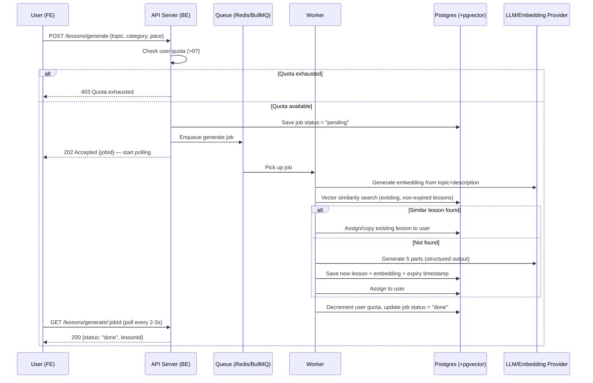

# Architecture — Edisco

> Derived from `prd.md`. Focus: separate FE/BE as requested, without overengineering into microservices.

---

## 1. Design Principles

1. **FE and BE are separated** (per Wil's decision), but the backend remains **one primary service (modular monolith)**, not full microservices. Rationale: small/solo team, low initial traffic volume, full microservices (many small services with network calls between them) add operational complexity (deployment, observability, service discovery) that isn't justified yet at the MVP stage.
2. Only **3 components** actually need separation:
   - **Web App (FE)** — Next.js, renders the UI, already familiar to Wil.
   - **API Server (BE)** — handles auth, CRUD, quota/reuse business logic, and publishes generate jobs.
   - **Worker (separate async process)** — dedicated to running the generation pipeline (calling the LLM, embeddings, saving results). Separated from the API server because the process is long-running (10–30 seconds) and must not block HTTP requests.
3. This is **not** microservices in the sense of "one service per domain (User service, Lesson service, etc.)" — all domain logic stays in one BE codebase; only the generation process is executed on a separate worker via a **queue**, not via complex network calls between services.

---

## 2. Recommended Tech Stack

| Layer | Choice | Rationale |
|---|---|---|
| Frontend | **Next.js (App Router)** | Matches Wil's existing skills, SSR/SSG for performance, easy to make PWA-ready. |
| UI Library | **shadcn/ui** + Tailwind CSS | Lightweight (not a heavy component library), customizable, matches Wil's preference ("light but good-looking"). |
| State Management | **TanStack Query** (server state) + **Zustand** (light client state, e.g. temporary onboarding data) | Lightweight, no need for Redux at this scale. |
| Backend | **Node.js + Fastify** (or Hono for something even lighter) | Lighter than Express, better throughput, TypeScript-first. |
| Database | **PostgreSQL** | Relational fits the structured user/lesson/progress data well. |
| Vector/Embedding Store | **pgvector (Postgres extension)** | No need for a separate vector DB infrastructure (e.g. Pinecone) in the MVP — just 1 database, reducing operational overhead. Migrating to a dedicated vector DB can be a v2 if scale demands it. |
| Queue/Job | **BullMQ (on top of Redis)** | Lightweight, mature, well-suited for the async lesson-generation job. Redis is also used for caching & simple rate-limiting. |
| Auth | **Lucia Auth** or **Auth.js (NextAuth)** | Auth.js is more familiar and integrates well with Next.js; Lucia gives more control if you want it lighter. → Recommendation: **Auth.js** for the MVP (faster development). |
| LLM Provider | See §3 below | — |
| Embedding Model | See §3 below | — |
| FE Hosting | Vercel | Native fit for Next.js. |
| BE + Worker Hosting | Railway / Fly.io / Render | Supports long-running worker processes + Redis + Postgres on one platform, affordable for MVP. |

---

## 3. LLM & Embedding Recommendations (Cost-Optimized)

> This is a recommendation based on cost vs. quality tradeoffs for "generating structured lesson content" — **not** a final decision; it must be re-validated during implementation since API pricing changes quickly.

### LLM for generating lesson content
- **Primary candidate:** a "mini/flash" tier model (low cost per token) from a major provider — e.g. the affordable tier from OpenAI (GPT-4o-mini or equivalent) or Anthropic (Claude Haiku). For structured content (5 parts per lesson, JSON format), this tier is usually **sufficient**, since the task leans more toward "follow the template and fill in content" than complex reasoning.
- **Recommendation:** start with the cheapest model from either provider, measure output quality empirically (not by assumption), then upgrade to a pricier model **only for categories that need high precision** (e.g. math/coding questions that must be 100% correct), while language/general-concept categories stay on the cheap model.
- **Structured output:** must use the provider's *structured output / JSON mode* feature (not manual parsing of free-form text) to keep generated results consistent and easy to validate before saving.

### Embedding for similarity check
- Use a **small/cheap-tier** embedding model (e.g. equivalent to `text-embedding-3-small`) — lower dimensionality than larger models, accurate enough for detecting "similar topic + level," and much cheaper since it's called on **every** generate request (not just occasionally).
- Store embeddings in a `vector` column (pgvector) on the Lesson table, indexed with **HNSW** or **IVFFlat** for fast nearest-neighbor search.

> ⚠️ **Decision needed from Wil:** which provider to use (OpenAI vs. Anthropic vs. a combination)? This determines which SDK gets integrated into `worker`. Recommendation: **mixing is fine** — LLM generation can use one provider, embeddings can come from a different (cheaper) one, since there's no lock-in requirement that they match. Tracked in `open-questions.md`.

---

## 4. Lesson Generation Flow (Async)



**Why polling instead of WebSocket?** For the MVP, simple polling (every 2–3 seconds, lightweight request) is sufficient and far simpler infrastructure-wise than WebSocket/SSE. Upgrading to SSE can be considered in v2 for real-time UX without polling overhead.

---

## 5. Folder Structure (High-Level)

```
/apps
  /web                 → Next.js FE
    /app
      /(onboarding)/...
      /(main)/track
      /(main)/lesson
      /(main)/new
      /(main)/league
      /(main)/profile
    /components/ui     → shadcn components
    /lib
  /api                 → Fastify BE
    /src
      /modules
        /auth
        /users
        /tracks
        /lessons
        /league
        /quota
      /jobs            → BullMQ job definitions (invoked from modules/lessons)
    /prisma (or Drizzle) → schema.prisma
  /worker              → separate process, consumes the same queue
    /src
      /generators
        /templates     → per category (coding, language, math, science, engineering, general)
      /embedding
/packages
  /shared-types         → TypeScript types shared across FE/BE/worker (API contract)
```

> **Note:** `worker` is a separate Node.js process (can live in the same monorepo as `api`, run as a different process), **not** a new HTTP service — it only subscribes to the queue. This keeps complexity low compared to microservices with REST/gRPC between services.

---

## 6. Why Not Full Microservices?

Considered and **rejected for the MVP** because:
- There's no need for independent per-domain scaling right now (user count is unknown, likely still small early on).
- Microservices add operational cost: need an API gateway, service discovery, distributed observability (cross-service tracing), and a more complex deployment pipeline — all of this is *overhead* with no proven benefit at MVP scale.
- A modular monolith (BE) + a separate worker for one specific reason (long-running process, must be async) already delivers the **main benefit** of microservices (isolating heavy processes) without the full complexity.

**When to consider full microservices?** If lesson-generation volume becomes very high and needs to scale the worker independently from the API server at large scale (e.g. hundreds of jobs/second), or if the team grows into multiple teams that need independent per-domain deployments.
